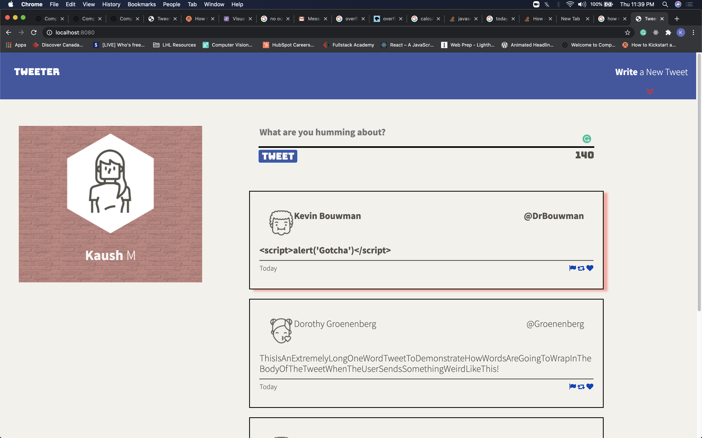
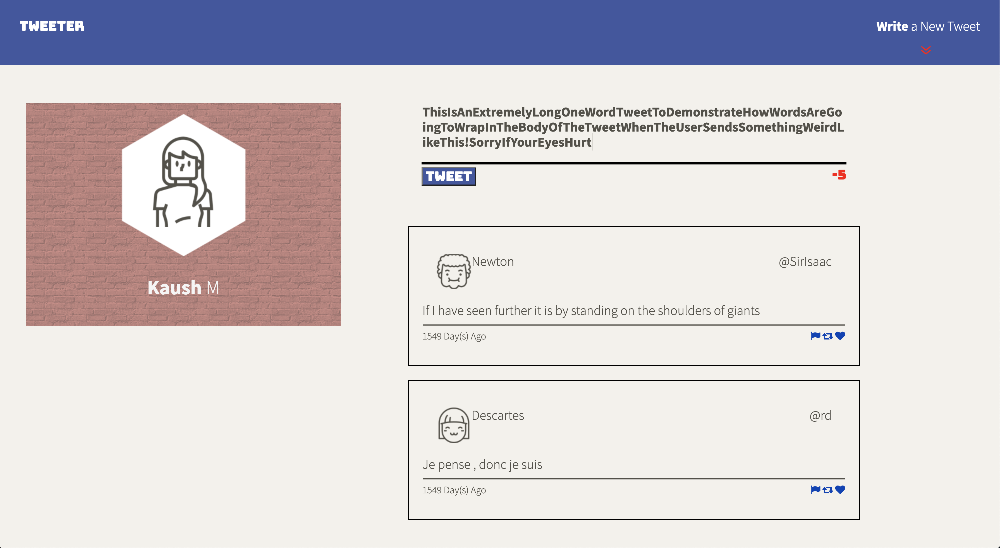
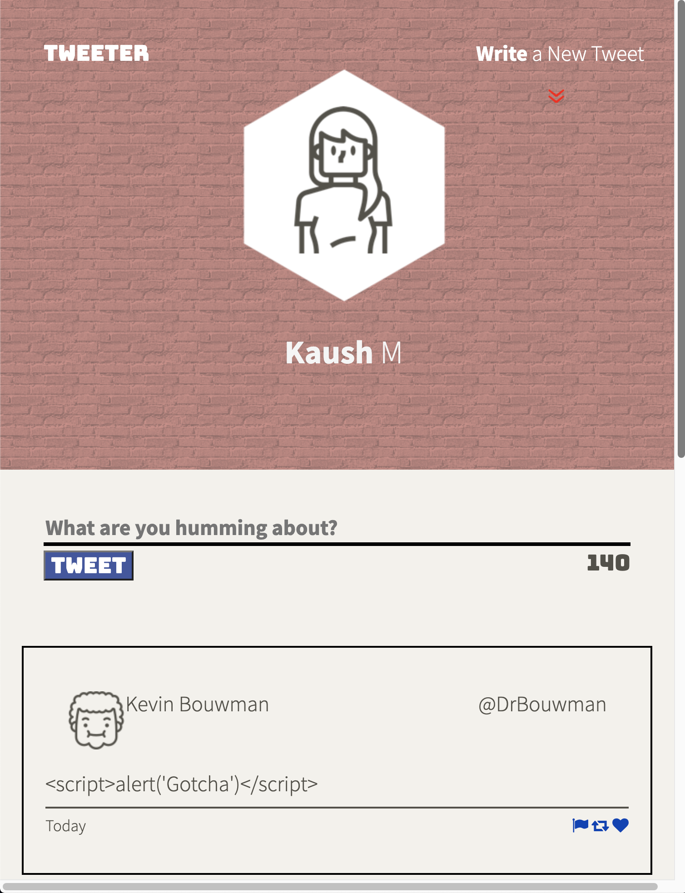
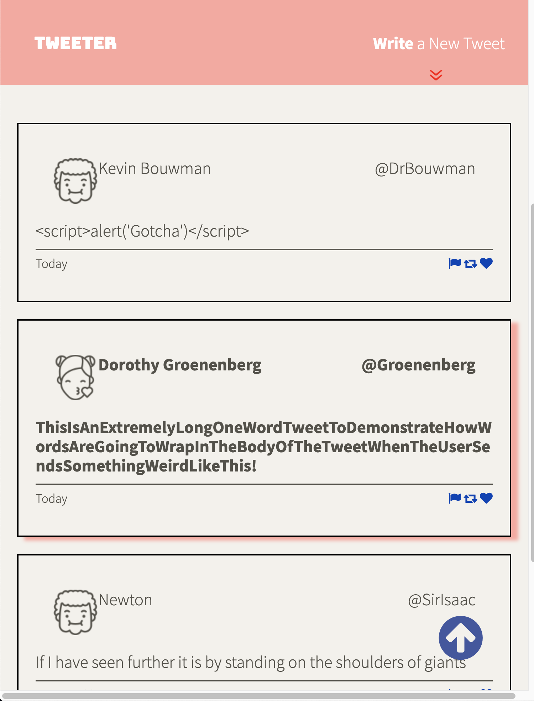

# Tweeter Project

Tweeter is a simple, single-page Twitter clone.

The app escapes malicious code, handles requests using AJAX and is built using Responsive principles.

## Final Product

## Getting Started

- Install all dependencies (using the `npm install` command).
- Start the web server using the `npm start` command.
- Run the development web server using the `npm run local` command.
- Go to localhost:8080 to view a demo

## Dependencies

- Express
- Node 5.10.x or above
- Body Parser
- Chance
- md5

## Dev-Dependencies
- nodemon
